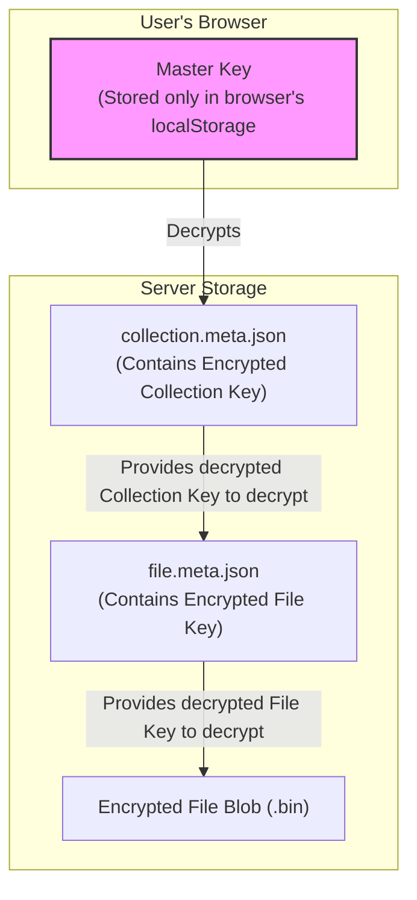
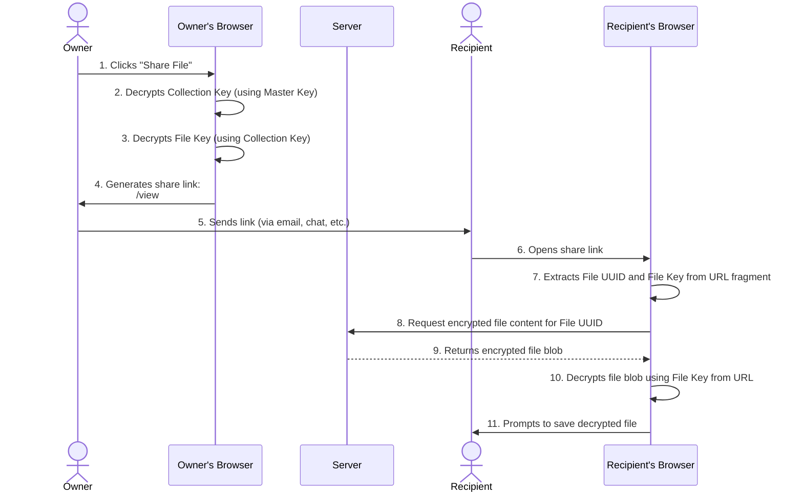
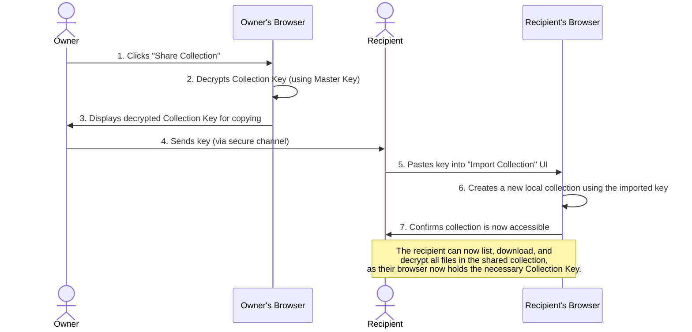

# Sharing Architecture

This document describes the architecture for sharing files and collections in Whispers, based on a hierarchical, "envelope encryption" model. This design allows for granular sharing without ever exposing the user's master key or unintended files to a recipient.

## Key Hierarchy

The security of the sharing model relies on three layers of keys. The server only ever stores encrypted keys and encrypted file content. Decryption always happens on the client.

1.  **Master Key**: The root of trust. It is generated in the user's browser and never leaves. It encrypts/decrypts Collection Keys.
2.  **Collection Key**: A unique key for each collection. It is encrypted by the Master Key and stored on the server. It encrypts/decrypts File Keys within that collection.
3.  **File Key**: A unique key for each file. It is encrypted by the parent Collection Key and stored on the server. It directly encrypts/decrypts the file's content.

---

## Sharing an Individual File

Sharing a single file is accomplished by generating a special link that contains the file's unique, decrypted key in the URL fragment. The key never passes through the server.

**Revoking Access**: The owner revokes access simply by deleting the file. Any subsequent attempt to use the share link will result in a "File not found" error from the server.

---

## Sharing an Entire Collection

Sharing a whole collection is done by securely transferring the collection's decrypted key to another user, who can then import it into their own Whispers instance.

**Revoking Access**: The owner revokes access by deleting the entire collection on the server.

---